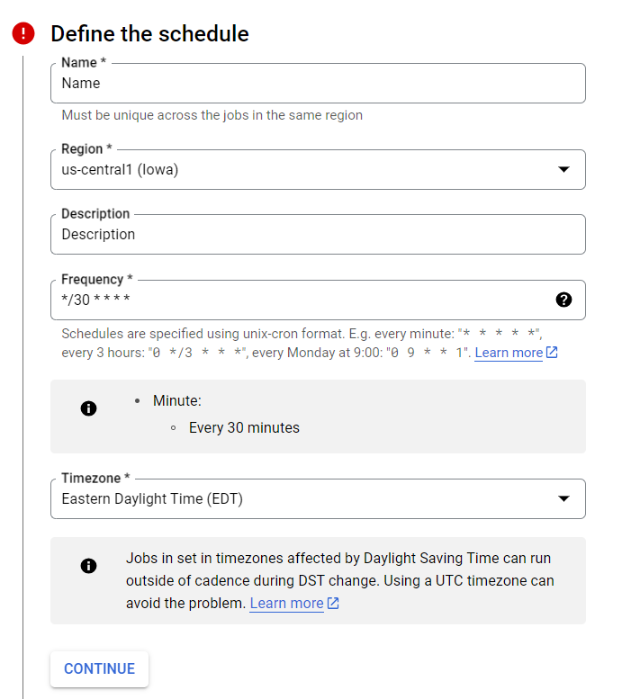

# Google Cloud Uptime Notifications
- *The implementation of a google cloud function that issues email notifications if a specific Google Cloud VM instance is running and exceeds an uptime of more than 2 hours*
- *A cloud scheduler is used to periodically run the cloud function (every 30 minutes)*
- *Written in python*
- *Developed in June 2023*

 

# Pre-requisites
- *This method sends emails manually using the SMTP and email.message modules in python. This means that it does NOT interact with the emails specified in the Google Cloud Notifications Center. It sends emails to all email addresses stored within a list/array in python (stored as an environment variable for security reasons)*
- *Therefore, you will be required to use an existing, or newly created, gmail account to issue these email notifications*

## Setting up a gmail account for GCP Notifications
- In order to use your gmail account to send emails in python, you must have 2FA enabled.
- If you do NOT have 2FA enabled on your gmail account, use the following documentation for setup:  
https://support.google.com/accounts/answer/185839?hl=en&co=GENIE.Platform%3DDesktop&oco=1
- After you have enabled 2FA, you must set up an app password to use for your python program.

*Setting up an App Password*
1. Click on your profile in the top right corner, and select `Manage your Google Account`.
2. In the search bar, type in app passwords, and choose the selection called `App passwords`.  
*This can also be found at:* https://myaccount.google.com/apppasswords
3. In the following window, select `Other (Custom name)`, and choose a name for your app password.   

4. When you create the app password, another window will appear, which will show you a 16-character app password. Note this down, as this is what we will use later to authenticate to our gmail account in our python code.

 

# How to set up GCP Notifications

## Step 1: Create a Google Cloud Function
1. Navigate to `Cloud Functions` in the Google Cloud Console. Then, click on `Create Function`.
2. Use the following configuration for the `Basics` section.   

3. Hit `Next`. Then, choose Python 3.11 as the runtime environment for this function.
4. When you are finished, click on `Deploy`.
5. You have now created your first cloud function!

## Step 2: Add the Source Code
1. Navigate to `Cloud Functions` in the Google Cloud Console. Then, click on the cloud function that you just created.
2. Click on the `Source` tab, which will open up the code editor for this cloud function.
3. Click on `Edit`, then hit `Next`. You can now edit from within the code editor.
4. Click on the `+` to add new files to your project. You should already have a `main.py` and a `requirements.txt`.
5. Add `date_library.py` and `email_library.py` to the project. These files can be found in the `/src` directory of this repository.
6. Update `main.py` and `requirements.txt` to the code found within this repository.
6. Your project should look like the following:   

*Note: The name of your function in main.py must match the entry_point of your function. Make sure to keep these the same!*

## Step 3: Set up Environment Variables
*To keep confidential information private and secure, we will use environment variables*   
1. From within `Cloud Functions`, click on the `Variables` tab. From here, you can view the environment variables that your project currently uses.
2. To add new environment variables, click `Edit`. Then, scroll down to `Runtime, build, connections and security settings`.
3. Click on this menu to open it. Scroll down to the bottom, where you will find `Runtime variables`.
4. Create 6 new variables, and use the following names and associated data:
    - PROJECT_ID: "your project's id"
    - ZONE: "your project's zone"
    - INSTANCE_NAME: "your VM instance's name'
    - SENDER: "the gmail account that you set up before for python emails"
    - PASSWORD: "the 16-character app password that you set up before"
    - RECEIVER: "the list of email addresses that will receive emails from the sender"

    For the RECEIVER list, it should be a comma-separated string. For example:  
    test1@example.com,test2@example.com,test3@example.com

*Note: DO NOT add quotes to any of the environment variable data. Google Cloud will automatically interpret them as strings. Additionally, DO NOT leave any spaces in the comma-separated string for the RECEIVER environment variable.*  

5. When you are finished, click on `Next`. Then, click `Deploy` to save your changes.

## Step 4: Create a Google Cloud Scheduler for your Cloud Function
1. Navigate to `Cloud Schedulers` in the Google Cloud Console. Then, click on `Create Job`.
2. Under `Define the Schedule`, use the following configuration:   

3. Under `Configure the Execution`, select `HTTP` as the target type. Use your cloud function's URL as the URL field, and `POST` as the HTTP method.   

4. When you are ready, click `Create` to deploy the scheduler.

### Everything should now be setup, and you should have functioning Google Cloud Email Notifications!